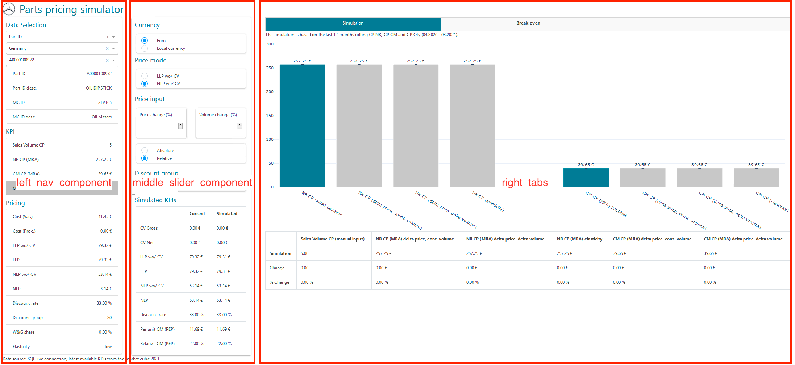

# Parts pricing simulator app

The link to the app as of March 2021:  

https://trucks-eu-web-analyticspricingapp.azurewebsites.net

This readme describes how to start the Parts pricing simulator app and how the different components 
interact with each other. Only the high-level interplay of the different classes and their 
interfaces are described. For technical details and inner mechanics of the different modules, 
please refer to the comments in the files themselves.

## Setup

### 1a. Environment variables DSVM

##### These settings are for the DSVM1 as of March 2021 and might need to be adjusted!

Proxy:
- http_proxy="http://53.13.8.158:3128"
- https_proxy="http://53.13.8.158:3128"
- no_proxy="169.254.169.254"

SQL:
- SQL_USERNAME=
- SQL_PASSWORD=

### 1b. Environment variables for Azure Web Apps deployment

Adls:
 - APPSETTING_adls_account_name
 - APPSETTING_client_id

SQL:
 - APPSETTING_database_server
 - APPSETTING_database_name
 - APPSETTING_database_user
 - APPSETTING_database_password


### 2. Python environment

##### **Caution:** The same python environment as on Azure Webapps should be used for all developments. do not use the speedboat conda environment.

Prerequisites:

Python>=3.8

updated setuptools and pip (`pip install --upgrade setuptools pip`)

To **create the python environment** move to the project root directory (i.e. ./pricing-speedboat) and execute the following command to create the enviroment:  

`python -m venv antenv`

Then activate the environment with (from the project root directory ./pricing-speedboat):

For Linux/Mac:   

`source antenv/bin/activate`

For Windows:

`antenv\Scripts\activate.bat`

Then install all packages required for the app with:

`python -m pip install -r requirements.txt`

### 3. Run the app
To run the code you must activate the python environment (from the project root directory ./pricing-speedboat):

`source antenv/bin/activate`

The app is started with the following command.

`python app.py`

## Data

The app is depending on the following data sources in the SQL database:

sql_data_sources:
 - market_cube: ``[dbo].[market_cube]``
    - main table for the app. For all prices, meta data (descriptions), everything that is not from
    the other tables.
 - currency_table: ``[dbo].[pep_currency_mapping]``
    - used to get the currency signs for the local currencies
 - discount_table: ``[dbo].[pep_dealer_discount_clean]``
    - used to fill the discount group dropdown menu with possible discount rates for a selected
    market
 - mra_monthly: ``[dbo].[mra_report_kpis]``
    - used to calculate the NR and CM 12 months rolling (also previous 12 months rolling)
 - elasticity: ``[dbo].[elasticity]``
    - table with the elasticity values for the simulation

The KPI definitions that can be replaced by other values can be configured in the config file 
(``.config_env/config.yaml`` subsection: APP CONFIGURATION)

## Structure

The app is split into different files depending on the position and function in the app.

```
+ -- speedboat-offline/
    + .config_env/config.yaml
    + .src/simulation/
        + components/
            + callbacks.py
            + left_nav_component.py
            + middle_slider_component.py
            + right_tabs.py
        + azure-pipelines.yml
        + calculations.py
        + helper.py
        + plots.py
    + app.py
```

The config file is shared with the rest of the repository (``.config_env/config.yaml``)

The starting point for the app is the ``app.py``. This is also the file that is used by 
Azure Web Apps to start the app. Once deployed it will only start if the ``app.py`` is on the root
path of the repository (speedboat-offline/). The file holds the ``Simulation`` class that 
initiates the app with the overall html layout.

The main simulation calculations can be found in the ``calculations.py``. 
This hold the ``Calculations`` class with the pricing formulas.

The file ``helper.py`` hold small functions that are used at multiple places in the app.

Inside the file ``plots.py`` are the ploty plots (mainly the bar chart) that can be created with 
the class ``Plots``.

The sub folder ``components`` holds the detailed layout of the app separated by left middle and right:



- ``left_nav_component.py``:
    - This file holds the ``Left_nav`` class with the dash/html layout for the left side of the app
    with the dropdowns and the KPI list
- ``middle_slider_component.py``:
    - This file holds the ``Middle_slider`` class with the dash/html layout for the middle part of
    the app with the pricing simulation inputs and the simulation table
- ``right_tabs.py``:
    - This file holds the ``Right_tabs`` class with the contents of the right tabs (currently
    the simulation tab)
    
The file ``components/callbacks.py`` defines all interactions in the app. All of those are defined
as Dash callbacks (https://dash.plotly.com/basic-callbacks)

### config file

The config for the app can be found in the ``APP CONFIGURATION`` section of the config file 
(``.config_env/config.yaml``)


## Deployment

The deployment is done in 2 steps:

1. **Azure DevOps Pipeline**:  
The Azure DevOps deployment script can be found here: ``.src/simulation/azure-pipelines.yml``. It
should only be changed through the Azure DevOps! https://dev.azure.com/daimler/CSPAdvAnalyt/_build?definitionId=10083
2. **Azure DevOps Release**:  
https://dev.azure.com/daimler/CSPAdvAnalyt/_release?_a=releases&view=mine&definitionId=6

Once the app is deployed it can be reached here: https://trucks-eu-web-analyticspricingapp.azurewebsites.net

### Debugging

To see the python logs of the app go to `Log stream` on the Azure Web Apps, App service page.
There a stream of the logs can be seen. Any errors in the python code or connection issues (SQL)
with the database should be visible there. If this does not help there are also docker container 
logs. The link to those files can be found **IN** the log stream.   

E.g. search for lines that look like this:
```/home/LogFiles/2021_03_16_RD281878137CE1_msi_docker.log  (https://trucks-eu-web-analyticspricingapp.scm.azurewebsites.net/api/vfs/LogFiles/2021_03_16_RD281878137CE1_msi_docker.log)```

The docker logs can be inspected by copy-pasting the `https...` part to the address bar of your
browser. The logs can give hints why the app failed to run.

# Sphinx documentation

To render the docstrings in html.

The source sphinx documentation is in ./docs/sphinx and the built html documentation is stored in ./docs/build/html

To run the following command, first activate the project conda environment (pricing-speedboat).   
To clean the build folder (if needed) `sphinx-build -M clean docs/sphinx docs/build` from the project root directory (i.e. pricing-speedboat)    
To build the code documentation automatically generated from docstrings execute `sphinx-apidoc -o docs/sphinx -f src` from the project root directory.      
To build the html documentation in make mode, execute `sphinx-build -M html docs/sphinx docs/build/html` from the project root directory.


